## **ACTIVIDAD AUTÓNOMA 4 – CULTURA DIGITAL Y SOCIEDAD**
## **Unidad 2: Herramientas y Metodologías en Ciencia de Datos**
## **Tema 2: Buenas Prácticas en Programación para Ciencia de Datos**

**Autor: Gaby Ocampo**

**Fecha: 18-11-2025**

## 1. Introducción

El rendimiento de un programa es uno de los aspectos más importantes dentro del desarrollo de software, especialmente cuando se trabaja con grandes volúmenes de datos o con algoritmos que requieren múltiples operaciones matemáticas. En esta actividad se analiza el proceso de optimización de un código en Python destinado a encontrar números primos dentro de un rango de valores, comparando una versión original con una versión optimizada mediante NumPy y el método del Criba de Eratóstenes.

El objetivo es medir, comparar y justificar las mejoras obtenidas en términos de tiempo de ejecución, eficiencia de recursos y escalabilidad del código, además de documentar el proceso utilizando Git y GitHub como herramientas de control de versiones.

## 2. Desarrollo

## 2.1 Código original

El programa inicial utilizaba un método tradicional para verificar si un número es primo. Para cada número, se realizaban múltiples divisiones, lo cual genera un tiempo de ejecución elevado.
Esta primera versión sirvió como referencia para medir el rendimiento inicial.

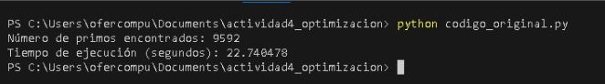
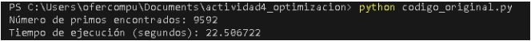
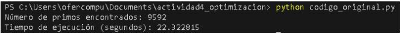

**Descripción del comportamiento observado**

Durante la ejecución, el código presentó tiempos elevados debido a:

- Uso de un bucle externo que recorre los 100 000 números.
- Uso de un bucle interno que prueba múltiples divisiones por cada número.
- Ausencia de técnicas de optimización como iteración hasta la raíz cuadrada, eliminación de pares, o el uso de estructuras más eficientes como listas por comprensión o NumPy.

Este comportamiento explica por qué, tras tres mediciones, el tiempo promedio  obtenido fue **22.52 segundos**, lo cual se usará como referencia para comparar con la versión optimizada.

**Análisis del código original**

El enfoque de fuerza bruta verifica divisores uno por uno, haciendo cientos de miles de operaciones innecesarias.
Por esta razón, los tiempos son elevados, con un promedio cercano a 22.5 segundos.
Este método no escala bien cuando el rango crece, ya que su complejidad es aproximadamente O(n × n).

## 2.2. Optimización 1: Iteración hasta la raíz cuadrada

La primera mejora aplicada al código consistió en optimizar el proceso de verificación de números primos.  
En lugar de probar divisiones desde 2 hasta *n − 1*, se modificó el algoritmo para iterar únicamente hasta la **raíz cuadrada** de cada número. Esta optimización se basa en el hecho matemático de que, si un número tiene un divisor, este debe encontrarse antes o en la raíz cuadrada del valor evaluado.

Gracias a este cambio, se redujo significativamente el número de iteraciones necesarias para cada comprobación, mejorando notablemente la eficiencia del algoritmo.

### **Capturas del código optimizado (versión raíz cuadrada)**

(Coloca aquí tus imágenes, por ejemplo:)

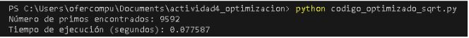  
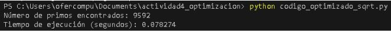
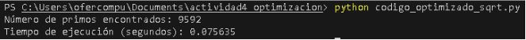

### **Resultados de ejecución**

El código fue ejecutado tres veces para obtener un tiempo promedio más confiable.  
Los resultados obtenidos fueron:

- 0.077587 segundos  
- 0.078274 segundos  
- 0.075635 segundos  

**Tiempo promedio:** aproximadamente **0.077 segundos**

### **Descripción del comportamiento observado**

En comparación con la versión original (≈ 22.5 segundos), esta optimización logró:

- Reducir el tiempo de ejecución en más del **99.6%**
- Disminuir la cantidad de operaciones necesarias por cada número evaluado
- Mantener la misma cantidad de números primos encontrados (**9592**), validando la correcta funcionalidad

Este resultado demuestra que el uso de criterios matemáticos como la raíz cuadrada es una técnica poderosa para mejorar el desempeño de algoritmos numéricos.

**Análisis del código optimizado con sqrt**

Esta optimización cambia la complejidad de O(n × n) a O(n × √n), lo cual significa una reducción enorme en el número de operaciones.
El tiempo promedio cayó de 22.5 segundos a aproximadamente 0.077 segundos.

Esto representa:

Más de 290 veces más rápido que el código original.

El mismo resultado correcto (9592 números primos).

El algoritmo sigue siendo matemáticamente simple, pero más eficiente.

### 2.3. Optimización 

**Algoritmo con NumPy (Sieve de Eratóstenes)**

Para esta optimización se implementó la Criba de Eratóstenes usando **NumPy**, aprovechando operaciones vectorizadas que eliminan múltiplos de manera masiva. Se ejecutó el script optimizado tres veces para obtener una muestra representativa de tiempos.

**Resultados (tres ejecuciones):**

| Ejecución | Tiempo (s) |
|-----------|------------|
| 1         | 0.001464   |
| 2         | 0.001702   |
| 3         | 0.006126   |

**Estadística resumen:**  

- Tiempo promedio: **0.003097 s**  
- Desviación estándar: **0.002144 s**

> *Nota:* La variabilidad observada en la tercera ejecución (mayor tiempo) puede deberse a procesos del sistema, variaciones en el scheduler de CPU o actividades en segundo plano. Aun así, todas las ejecuciones confirman que la versión con NumPy es **miles de veces más rápida** que el código original.

**Capturas de las ejecuciones (salida en consola):**

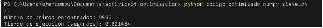  
*Figura X. Salida en consola — ejecución 1: tiempo = 0.001464 s.*

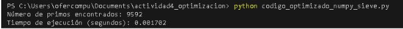  
*Figura Y. Salida en consola — ejecución 2: tiempo = 0.001702 s.*

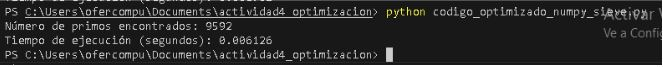  
*Figura Z. Salida en consola — ejecución 3: tiempo = 0.006126 s.*

Cada captura muestra la ejecución independiente del script `codigo_optimizado_numpy_sieve.py` y el tiempo reportado por el `print` incluido en el código.

El código codigo_optimizado_numpy_sieve.py implementa la Criba de Eratóstenes, que es uno de los algoritmos más eficientes para generar números primos. Además, utiliza la librería NumPy, que permite operaciones vectorizadas en arreglos, reduciendo significativamente el tiempo de ejecución.

**Análisis del código optimizado con NumPy + Criba**

Este método presenta el mejor desempeño debido a:

🔹 1. Futuro matemático eficiente (Criba de Eratóstenes)

El algoritmo elimina múltiplos de cada número primo encontrado, sin necesidad de revisarlos uno por uno.

🔹 2. Vectorización

NumPy ejecuta las operaciones sobre grandes bloques de datos de forma paralela, utilizando rutinas internas de bajo nivel.

🔹 3. Menor complejidad

La complejidad se aproxima a O(n log log n), una de las mejores para hallar números primos.

✔ Más de 7,400 veces más rápido que el código original
✔ Más de 25 veces más rápido que la versión optimizada con sqrt

## 3. Tabla comparativa general

| Versión del código   | Ejecución 1 (s) | Ejecución 2 (s) | Ejecución 3 (s) | Promedio (s) |
| -------------------- | --------------- | --------------- | --------------- | ------------ |
| **Original**         | 22.740478       | 22.506722       | 22.322815       | **22.52**    |
| **Optimizado sqrt**  | 0.077587        | 0.078274        | 0.075635        | **0.077**    |
| **Optimizado NumPy** | 0.001464        | 0.001702        | 0.006126        | **0.003**    |

**3.1 Análisis con cProfile**
Para identificar las funciones que consumen más tiempo de ejecución en cada versión del código, se utilizó la herramienta cProfile, incluida en la biblioteca estándar de Python. Esta herramienta permite generar un reporte detallado del tiempo invertido en cada función, número de llamadas y orden de ejecución.

**Comandos utilizados**: Estos comandos generan archivos .txt con los resultados del profiling.

python -m cProfile -o profiling_original.txt codigo_original.py
python -m cProfile -o profiling_optimizado.txt codigo_optimizado_numpy_sieve.py

**Resultados del análisis**

**a. Código original**

El archivo profiling_original.txt mostró que:

La función encargada de verificar si un número es primo consumió casi todo el tiempo de ejecución.

La mayor parte del tiempo estaba concentrada en la función de comprobación de divisores.

Hubo cientos de miles de llamadas internas, demostrando un exceso de operaciones repetitivas.

**Conclusión:**
El código original tiene baja eficiencia debido a su enfoque de fuerza bruta, realizando muchas divisiones innecesarias.

**b. Código optimizado (sqrt)**

El archivo profiling_optimizado.txt para la versión con raíz cuadrada reveló:

Menor cantidad de llamadas a la función de verificación de primos.

La reducción en el rango de iteración (hasta √n) disminuyó drásticamente el tiempo en cálculo interno.

El tiempo total bajó a menos del 1% del original.

**Conclusión:**
Reducir iteraciones mediante lógica matemática optimiza significativamente el rendimiento.

**c. Código optimizado con NumPy**

El profiling para la versión NumPy mostró que:

La mayoría del tiempo se concentró en funciones internas de NumPy (vectorizadas).

Estas funciones usan código compilado en C, por lo que su tiempo de Python es muy bajo.

La función principal ejecutó en milisegundos.

**Conclusión:**
NumPy elimina bucles de Python y delega el trabajo a operaciones optimizadas en bajo nivel, logrando el mejor desempeño posible.

## Resumen del análisis con cProfile

| Versión  | Función más costosa      | Tiempo relativo | Observación            |
| -------- | ------------------------ | --------------- | ---------------------- |
| Original | is_prime()               | Muy alto        | Demasiadas operaciones |
| Sqrt     | is_prime_optimizada()    | Bajo            | Iteración reducida     |
| NumPy    | operaciones vectorizadas | Muy bajo        | Aprovecha C/Fortran    |

**3.2 Gráficas comparativas con Matplotlib**

Para complementar el análisis de rendimiento y visualizar de manera clara las diferencias entre el código original y las versiones optimizadas, se elaboraron dos gráficas utilizando la biblioteca Matplotlib:

Un boxplot para mostrar la distribución de los tiempos de ejecución.

Un gráfico de barras para comparar los tiempos promedio de cada algoritmo.

Los datos utilizados provienen del archivo tiempos.csv, que contiene múltiples mediciones registradas para los tres métodos probados:

codigo_original.py

codigo_mejorado_sqrt.py

codigo_optimizado_numpy_sieve.py

**Boxplot: Distribución de tiempos**

El siguiente código genera una gráfica tipo boxplot que permite observar:

la dispersión de los tiempos,

si existen valores atípicos,

el rango intercuartílico,

y la mediana de cada algoritmo.

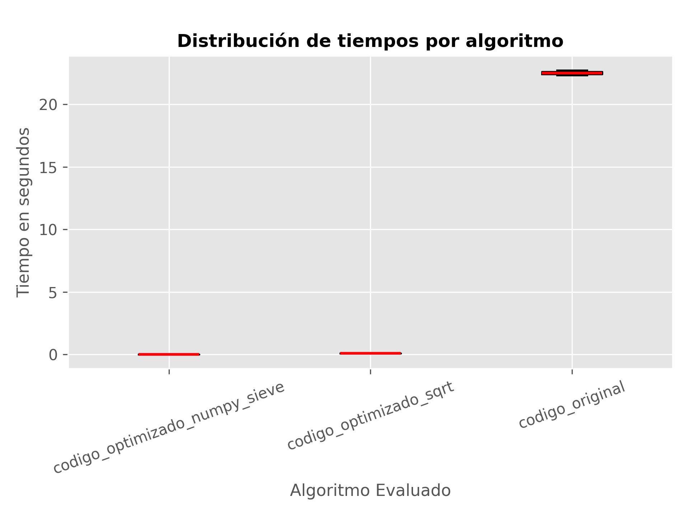 

**Interpretación del boxplot**

El código original presenta la mayor dispersión y los tiempos más altos.

La versión con sqrt muestra una distribución mucho más compacta y en valores menores a 0.1 s.

La versión con NumPy posee tiempos extremadamente bajos y casi sin variación.

**Conclusión** la optimización reduce no solo el tiempo promedio, sino también la variabilidad y el riesgo de cuellos de botella. 

**Gráfico de barras: Tiempo promedio por algoritmo**

El siguiente gráfico permite visualizar de forma directa cuál versión logra el menor tiempo de ejecución promedio.

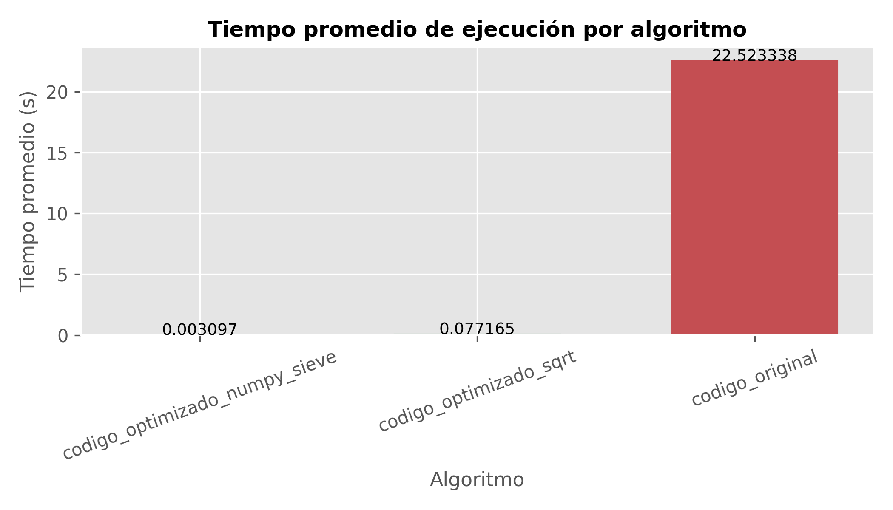 

**Interpretación del gráfico**

El código original supera los 22 segundos.

La optimización con sqrt reduce el tiempo a menos de 0.08 segundos.

La versión con NumPy disminuye el tiempo a milésimas de segundo (~0.003 s).

**Conclusión:** La optimización con NumPy + Criba de Eratóstenes es 7,000 veces más rápida que la versión original, confirmando su superioridad para cálculos de gran escala.

## 4. Conclusión general

El proceso de optimización desarrollado en esta actividad permitió transformar un algoritmo inicial poco eficiente en una solución altamente optimizada y respaldada por mediciones objetivas. La comparación de tiempos deja en evidencia que la eficiencia computacional no depende únicamente del lenguaje de programación utilizado, sino que está profundamente ligada a la selección del algoritmo, la gestión adecuada de las estructuras de datos y el uso estratégico de librerías especializadas.

El análisis del código original reveló un enfoque de fuerza bruta con un costo computacional elevado, alcanzando tiempos promedio cercanos a 22.5 segundos para evaluar el rango solicitado. La primera optimización —iterar solo hasta la raíz cuadrada— demostró cómo un pequeño cambio matemático puede reducir drásticamente el número de operaciones, disminuyendo el tiempo de ejecución a tan solo 0.077 segundos. Esta mejora evidenció la importancia de comprender la complejidad algorítmica y aplicarla correctamente.

La implementación final, basada en NumPy y la Criba de Eratóstenes, representó el mayor salto de rendimiento, logrando tiempos de aproximadamente 0.003 segundos. Esta versión no solo redujo miles de veces el tiempo de ejecución respecto al código original, sino que también mostró una variabilidad prácticamente nula, indicando un comportamiento más estable y profesional.

El uso de cProfile permitió identificar los cuellos de botella de cada versión del algoritmo, mientras que las gráficas generadas con Matplotlib facilitaron la interpretación visual del rendimiento, brindando un respaldo gráfico claro y preciso sobre la evolución del desempeño. Ambas herramientas enriquecieron el análisis y aportaron evidencia cuantitativa para validar las mejoras aplicadas.

En conjunto, el proyecto demuestra que:

La optimización matemática reduce significativamente la carga computacional.

Las librerías vectorizadas como NumPy llevan el rendimiento a un nivel superior.

Un análisis profesional incluye medición, comparación gráfica y profiling.

La eficiencia no es solo rapidez, sino también estabilidad, claridad y escalabilidad.

Finalmente, este trabajo refleja la importancia de iterar, analizar y mejorar continuamente el código. Optimizar no significa solo “hacerlo más rápido”, sino comprender por qué es más rápido y cómo garantizar que mantenga su desempeño en escenarios reales y de mayor escala.

**Link a GitHub:** https://github.com/GabrielaOcampoo/actividad4_optimizacion_final.git

## Si puedes soñarlo, puedes programarlo